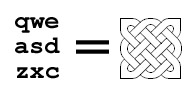
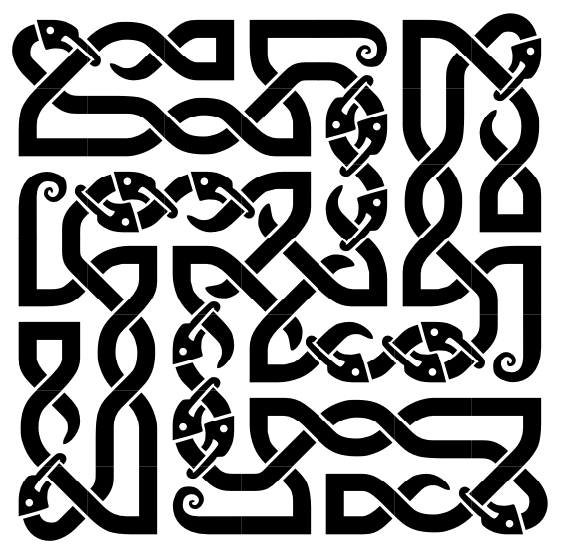
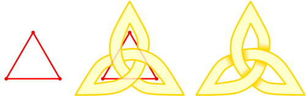
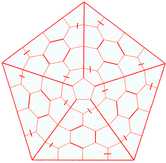
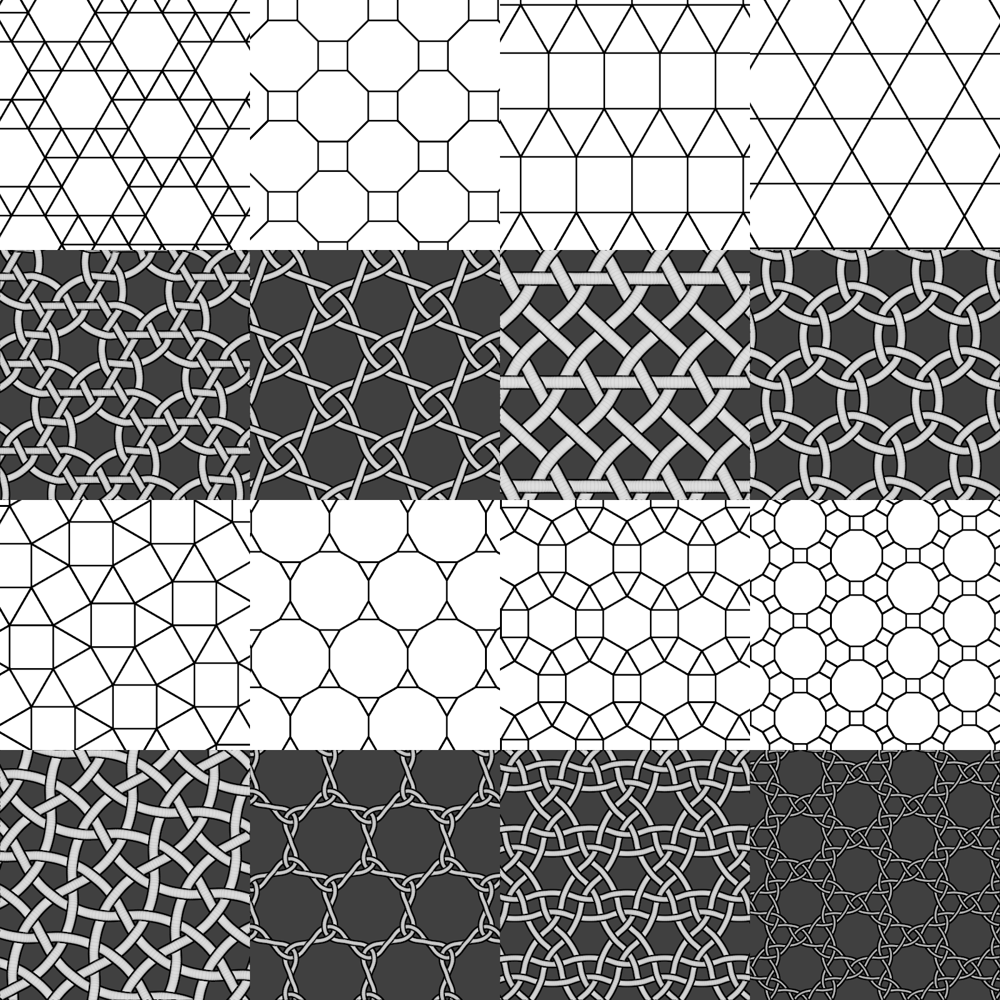

I'm doing some research on how to draw celtic knots (with computers, preferably), and it turns out much information about this subject is scattered. I'll try and list some interesting attempts here:

## The Celtic Knot Font

[This](https://www.clanbadge.com/knots.htm) is simple and clever! The font transforms each character into a square tile that can connect to its neighbour at its edges, similar to a trunchet tile.

Making it a font makes it genuinely fun to use and also trivial to color. These patterns can be mixed and matched to make impressive murals like this (by Henry Segerman):

This seems to date back to the early 2000s, and is the earliest attempt that I've found.

## Knots Zoo

[The Knots Zoo](https://fontlibrary.org/en/font/knots) font uses pretty much the same idea, except with less tiles and more ornament:

The character-to-grid mapping is more compositional. For example, the top row of the simple knot `qwe` in the clanbadge font would be `OXXOOXXXOOXX` in Knots Zoo. See [this link](https://github.com/MrBenGriffin/Knot) for a more detailed explaination.

## Celtic Knotwork: The Ultimate Tutorial

[(archive.org)](https://web.archive.org/web/20200221221627/https://entrelacs.net/-Celtic-Knotwork-The-ultimate-tutorial) A pretty comprehensive guide to drawing celtic knotworks. Instead using a grid, this method uses a graph. Each of its vertices turn into a hole, and an edge a crossing:

This is a generalization of the grid approach. While the grid only affords squarish knots, this method allows for beauties like this:

This particular knot uses the dual graph, but the idea is the same.

## Blender Knot Plugin

Based on this idea, you can turn every tiling on a plane into a knot pattern!

[This](https://github.com/BorisTheBrave/celtic-knot/wiki/Gallery) is the most impressive attempt I've seen so far, which is a blender plugin that turns arbitrary 2D and even **3D** objects into knotty structures. You just have to see it to believe it.

## Misc

The paper "Celtic knotwork: Mathematical art" describes briefly how to draw a celtic knot, but then goes on to study their symmetries. I wonder if you use the right encoding can you turn the problem of knot symmetries into

[This](https://ctan.org/tex-archive/fonts/knot) seems to be yet another knot-making font for TeX, but I've yet to try it.
